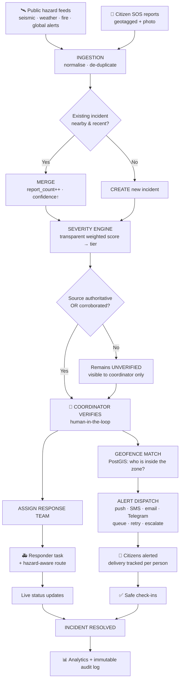
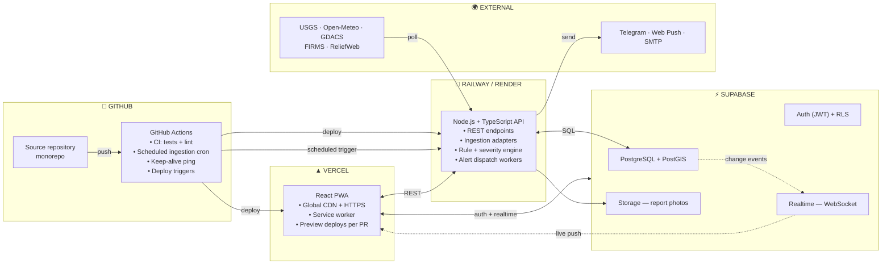

# Intelligent Disaster Monitoring and Emergency Communication Network

### Initial Project Report (Pre-Implementation / Design Phase)

---

| Field | Detail |
|---|---|
| **Project Title** | Intelligent Disaster Monitoring and Emergency Communication Network |
| **Document Type** | Initial Project Report — Problem Definition, Approach Selection & System Design |
| **Stage** | Pre-implementation (design and planning phase) |
| **Department** | Computer Science and Engineering |
| **Institution** | `[University / College Name]` |
| **Project Guide** | `[Guide Name]` |
| **Academic Year** | `[2025–26]` |
| **Document Version** | v1.0 — Initial Draft |
| **Date** | `[Date]` |

> **Note on this document.** This is an *initial* report prepared **before** implementation begins. It defines the problem, evaluates the two possible implementation approaches (hardware-based vs. software-based), justifies the chosen approach, and specifies the proposed design. Technology choices, APIs and module boundaries described here are **indicative and subject to refinement** during development. Any statistics quoted should be re-verified against primary sources before final submission.

---

## Table of Contents

1. [Abstract](#1-abstract)
2. [Introduction and Motivation](#2-introduction-and-motivation)
3. [Problem Statement](#3-problem-statement)
4. [Why This Product Is Needed — Gap Analysis](#4-why-this-product-is-needed--gap-analysis)
5. [Objectives](#5-objectives)
6. [Approach Analysis — Hardware vs. Software](#6-approach-analysis--hardware-vs-software)
7. [Decision and Justification](#7-decision-and-justification)
8. [Scope of the Project](#8-scope-of-the-project)
9. [Design Challenges Anticipated and Their Mitigation](#9-design-challenges-anticipated-and-their-mitigation)
10. [How the System Will Work — Operational Narrative](#10-how-the-system-will-work--operational-narrative)
11. [The Web Portal — Sections and Components](#11-the-web-portal--sections-and-components)
12. [Proposed Technology Stack](#12-proposed-technology-stack)
13. [Data Sources and External APIs](#13-data-sources-and-external-apis)
14. [Functional Requirements](#14-functional-requirements)
15. [Non-Functional Requirements](#15-non-functional-requirements)
16. [Deployment Architecture](#16-deployment-architecture)
17. [Expected Outcomes and Evaluation Metrics](#17-expected-outcomes-and-evaluation-metrics)
18. [Risk Register](#18-risk-register)
19. [Proposed Timeline](#19-proposed-timeline)
20. [Everything in Short — Executive Summary](#20-everything-in-short--executive-summary)
21. [Open Questions and Pending Decisions](#21-open-questions-and-pending-decisions)
22. [References](#22-references)

---

## 1. Abstract

Natural disasters continue to cause large-scale loss of life and property, not primarily because the events go undetected, but because **detection does not translate into timely, targeted, actionable communication with the people and responders who need it**. Meteorological departments, seismic networks and satellite systems already generate high-quality hazard data. The failure occurs in the "last mile": verifying reports, deciding who is actually at risk, reaching those specific people through channels they will see, and coordinating the response that follows.

This project proposes an **Intelligent Disaster Monitoring and Emergency Communication Network** — a cloud-hosted, full-stack web platform that:

1. **Continuously ingests** hazard data from multiple authoritative public sources (seismic, meteorological, satellite fire detection, global alert feeds) alongside **crowdsourced citizen reports**;
2. **Correlates and de-duplicates** these signals using rule-based spatio-temporal logic, so that hundreds of reports about one event become a single, confidence-scored *incident* rather than hundreds of separate alarms;
3. **Applies a transparent severity model** and routes each incident through a **human verification step** before any public alert is issued;
4. **Delivers geofenced, multi-channel alerts** only to users physically located inside the affected area, with per-recipient delivery tracking and escalation;
5. **Coordinates the response** through a live control-room dashboard, responder task assignment, hazard-aware routing, shelter and resource management; and
6. **Continues to function under degraded network conditions** through an offline-capable progressive web application that queues citizen reports locally and synchronises automatically on reconnection.

Two implementation approaches were formally evaluated: a **hardware sensor network** built on Raspberry Pi / ESP32 devices, and a **cloud-hosted software platform**. Following a weighted comparison across fifteen criteria, the **software approach has been selected**, for reasons of geographic coverage, cost, scalability, deployability, alignment with the Computer Science curriculum, and — most importantly — because it addresses the *actual* unsolved problem rather than duplicating sensing infrastructure that already exists at national and global scale.

**This project is therefore entirely software-based.** No physical sensor, microcontroller or embedded device forms any part of it. The sensing layer is supplied in full by two sources that already exist and require no construction: **institutional instrumentation** (Earth-observation satellites, seismic networks, weather models — all publishing openly and free of charge) and **citizen smartphones** (GPS, camera, network, and a human observer capable of judgment). The entire system is implemented in TypeScript and deployed on free-tier cloud infrastructure at zero recurring cost.

---

## 2. Introduction and Motivation

### 2.1 Background

India experiences a wide spectrum of natural hazards — riverine and flash floods, tropical cyclones along both coasts, earthquakes across the Himalayan belt and Kutch region, landslides in the Western Ghats and Himalayas, forest fires, heatwaves and urban flooding. A large fraction of the population lives in multi-hazard-prone districts.

Significant national infrastructure already exists. Meteorological services issue forecasts and warnings. Seismic networks detect and report earthquakes within minutes. Satellite systems detect active fires and flooding. Disaster management authorities operate at national, state and district levels.

**And yet, in event after event, the same pattern repeats:**

- Warnings are issued, but do not reach the specific households in the flood path.
- Warnings that do arrive are broad and untargeted ("heavy rain expected in the state"), so recipients cannot judge whether *they* must act.
- Citizens on the ground observe the situation before any official does — a collapsing embankment, a blocked drain, a landslide across a road — but have **no structured channel** to report it into the system.
- Control rooms receive hundreds of phone calls about the same incident and cannot tell whether they are dealing with one event or twenty.
- Rescue teams are dispatched by voice call and paper logs, with no live picture of who is where.
- When mobile networks degrade — precisely when the disaster peaks — the entire digital communication chain fails.
- After the event, there is no reliable record of who was warned, when, and by whom.

### 2.2 The Core Insight That Motivates This Project

> **The bottleneck in disaster management is no longer *sensing*. It is *communication, verification and coordination*.**

The instruments that detect earthquakes, rainfall and fires already exist, are professionally calibrated, and publish their data openly. What does not exist — at least not in an integrated, accessible, deployable form — is the **software layer** that turns that data into:

- a *specific warning*, to a *specific person*, at a *specific location*, over a channel they will actually see,
- combined with what ordinary citizens can see with their own eyes,
- feeding a *coordination system* that tracks the response end to end,
- and which keeps working when the network does not.

That software layer is what this project builds.

### 2.3 A Second Insight: The Smartphone Is Already the Sensor

A modern smartphone contains a GPS receiver, a camera, an accelerometer, a network radio, a battery, a screen — and, critically, **a human being attached to it who can interpret what they are seeing**.

There are hundreds of millions of these devices already deployed, already powered, already connected, already maintained, at zero cost to this project.

Any sensor network a student team could build would consist of, at best, a handful of nodes in one building. The crowdsourcing approach makes **every user a sensor node** — one that can not only measure, but *photograph, describe and confirm*.

This single observation is the strongest argument for the software-based approach, and it is developed in detail in Section 6.

---

## 3. Problem Statement

### 3.1 Formal Statement

> Existing disaster management systems suffer from a **fragmented, one-directional and untargeted information flow**. Hazard data is distributed across multiple isolated sources with no unified view; official warnings are broadcast to broad geographic regions rather than to individuals genuinely at risk; citizens possess real-time ground truth but have no structured mechanism to contribute it; response coordination is conducted through manual, unauditable channels; and the entire chain depends on network connectivity that is most likely to fail at the moment of greatest need.
>
> **There is a need for a unified, intelligent, resilient software platform that aggregates multi-source hazard data, fuses it with verified crowdsourced reports, targets alerts to precisely the affected population, coordinates the emergency response in real time, and degrades gracefully under network failure.**

### 3.2 Decomposition into Sub-Problems

| # | Sub-Problem | Description | Consequence |
|---|---|---|---|
| **P1** | **Data fragmentation** | Seismic, meteorological, satellite and situational data live in separate portals with different formats, update frequencies and access methods. | No single operational picture; officials manually check multiple websites. |
| **P2** | **Untargeted broadcasting** | Alerts are issued at state or district granularity. A person 60 km from a flood receives the same message as a person 600 m from it. | Alert fatigue; recipients learn to ignore warnings; the genuinely endangered do not act. |
| **P3** | **No citizen-to-system channel** | Reporting is via voice helplines. There is no structured, geotagged, photo-supported reporting path. | Ground truth is lost; control rooms operate blind on local detail. |
| **P4** | **Duplicate report explosion** | A single event generates hundreds of independent reports with no automatic correlation. | Control room cannot distinguish one large event from many small ones; resources are misallocated. |
| **P5** | **Verification vs. speed dilemma** | Alerting instantly risks mass false alarms; verifying manually costs critical minutes. | Either public trust or public safety is sacrificed. |
| **P6** | **Manual, unauditable coordination** | Team dispatch via phone calls; status tracked on paper or WhatsApp. | No live view of responder positions; no record for post-event accountability. |
| **P7** | **Network fragility** | Cell towers lose power or become congested during disasters. Purely online systems stop working. | The system fails at exactly the moment it is most needed. |
| **P8** | **No feedback loop** | Authorities cannot tell whether an alert was delivered, or whether a citizen is safe. | Search and rescue cannot prioritise; families have no information. |
| **P9** | **Route invalidity** | Standard navigation apps do not know which roads are flooded or blocked. | Responders are routed into impassable roads, losing critical time. |
| **P10** | **No accountability record** | No immutable log of who issued what warning at what time. | Post-event review and legal accountability are impossible. |

### 3.3 Illustrative Real-World Context

Recent large-scale events in India and globally — including the Kerala floods (2018), Cyclone Amphan (2020), the Chamoli disaster in Uttarakhand (2021), and the Wayanad landslides (2024) — have been followed by after-action reviews that repeatedly identify the same categories of failure: **warning dissemination gaps, coordination breakdown, and loss of situational awareness**, rather than failure of detection instruments.

> ⚠️ **For final submission:** cite specific after-action reports, NDMA/NIDM publications or peer-reviewed papers for each event referenced, and verify all figures against primary sources. Do not quote casualty numbers without a citation.

---

## 4. Why This Product Is Needed — Gap Analysis

### 4.1 What Already Exists, and Where It Falls Short

| Existing System | What It Does Well | Gap It Leaves |
|---|---|---|
| **Meteorological / seismic agencies** (IMD, USGS, ISRO) | Authoritative, calibrated, scientifically rigorous hazard detection and forecasting | Output is *data and bulletins*, not personalised, actionable, location-targeted instructions. No citizen input path. No response coordination. |
| **Cell Broadcast / SMS alert systems** (e.g. national alert dissemination platforms) | Can reach large populations quickly | One-way only. Coarse geographic targeting. No acknowledgement, no verification loop, no coordination layer, no citizen reporting. |
| **Ushahidi** (open-source crowdmapping) | Excellent citizen crowdsourcing and mapping | Primarily a mapping/reporting tool. No automated multi-source hazard ingestion, no rule-based severity engine, no geofenced alert dispatch, no responder task management. |
| **Sahana Eden** (open-source disaster management) | Strong resource, shelter and organisation management | Heavyweight, complex to deploy, not real-time-first, weak on automated sensor-feed ingestion and modern mobile/offline experience. |
| **Commercial mass-notification platforms** | Reliable multi-channel delivery at scale | Expensive, closed, subscription-based; designed for corporate/campus notification, not multi-hazard public disaster response; no open hazard-feed integration. |
| **Social media** (X, WhatsApp, Facebook) | Fast, ubiquitous, high citizen participation | Unstructured, unverified, rumour-prone, not geospatially queryable, no severity model, no official workflow, no accountability. |

### 4.2 The Unoccupied Space

No single accessible system combines **all** of the following:

- ✅ Automated ingestion from **multiple** authoritative hazard feeds
- ✅ **Fused** with structured, geotagged, photo-supported citizen reports
- ✅ **Automatic correlation** of many reports into one confidence-scored incident
- ✅ **Transparent, explainable** severity scoring (not a black box)
- ✅ **Mandatory human verification** before public alerting
- ✅ **True geofenced targeting** — alerts to those inside a drawn polygon, not a whole district
- ✅ **Multi-channel delivery with per-recipient tracking** and escalation
- ✅ **Live responder coordination** with hazard-aware routing
- ✅ **Offline-first citizen application** that queues and auto-syncs
- ✅ **Immutable audit trail** of every decision and alert
- ✅ Deployable at **near-zero cost** on free-tier cloud infrastructure

**This project targets exactly that gap.**

### 4.3 Who Benefits

| Stakeholder | Benefit |
|---|---|
| **Citizens** | Receive warnings relevant to *their* location; can report emergencies in seconds; can find the nearest shelter; can inform family they are safe |
| **Rescue / response teams** | Receive structured, prioritised, geolocated tasks with photographs and a route that avoids blocked roads |
| **Control-room coordinators** | Single live operational picture; can verify, target and dispatch from one screen; can see delivery confirmation |
| **Administrators / authorities** | Post-event analytics, response-time metrics, and an immutable accountability record |
| **Researchers** | An open, extensible platform and a structured dataset of incidents and response times |

---

## 5. Objectives

### 5.1 Primary Objectives

1. **O1** — Design and implement a scalable, multi-source data ingestion subsystem that continuously aggregates hazard data from at least four independent public feeds into a unified normalised schema.
2. **O2** — Implement a transparent, rule-based incident correlation and severity-scoring engine that de-duplicates related signals into single confidence-scored incidents.
3. **O3** — Implement a geospatial targeting subsystem capable of resolving, in sub-second time, the exact set of users within an arbitrary alert zone.
4. **O4** — Implement a multi-channel alert dispatch subsystem with queueing, retry, escalation and per-recipient delivery tracking.
5. **O5** — Develop an offline-capable Progressive Web Application enabling citizens to submit geotagged emergency reports that queue locally and synchronise automatically.
6. **O6** — Develop a real-time coordination console providing live situational awareness, incident verification, team assignment and hazard-aware route computation.
7. **O7** — Implement role-based access control and an immutable audit trail across all privileged operations.
8. **O8** — Deploy the complete system to publicly accessible cloud infrastructure at zero recurring cost, and validate it against measurable performance criteria.

### 5.2 Secondary Objectives

- **O9** — Provide an analytics dashboard reporting response-time and delivery-performance metrics.
- **O10** — Provide multilingual and icon-driven interfaces to support low-literacy and non-English users.
- **O11** — Design the ingestion layer as a pluggable adapter architecture, so that additional public data sources can be added without modifying core system logic.

---

## 6. Approach Analysis — Hardware vs. Software

Two fundamentally different implementation strategies were evaluated before committing to a design. This section presents both fairly, then justifies the selection.

---

### 6.1 Option A — Hardware-Based Implementation (Raspberry Pi / ESP32 Sensor Network)

#### 6.1.1 Proposed Architecture

```
   PHYSICAL WORLD                SENSOR NODE              GATEWAY            CLOUD
   ──────────────                ───────────              ───────            ─────
   Rising water level  ──►  ┌──────────────────┐
   Rainfall            ──►  │  ESP32 / RPi     │      ┌─────────────┐    ┌──────────┐
   Ground vibration    ──►  │  + sensors       │ ───► │  LoRa /     │──► │  Server  │
   Smoke / gas         ──►  │  + power supply  │      │  GSM        │    │  + DB    │
   Temperature         ──►  │  + enclosure     │      │  gateway    │    │  + UI    │
                            └──────────────────┘      └─────────────┘    └──────────┘
```

#### 6.1.2 Typical Bill of Materials (per node)

| Component | Purpose | Indicative Cost (₹) |
|---|---|---|
| ESP32 / Raspberry Pi 4 | Microcontroller / SBC | 400 – 5,500 |
| HC-SR04 ultrasonic sensor | Water level | 150 |
| Tipping-bucket rain gauge | Rainfall measurement | 1,200 – 3,000 |
| MPU-6050 / ADXL345 | Vibration / seismic proxy | 200 |
| MQ-2 / MQ-135 | Smoke / gas detection | 200 |
| DHT22 | Temperature / humidity | 300 |
| NEO-6M GPS module | Node localisation | 400 |
| SIM800L GSM / LoRa SX1278 | Connectivity | 350 – 900 |
| Solar panel + Li-ion + charge controller | Autonomous power | 1,500 – 3,000 |
| IP65 weatherproof enclosure | Environmental protection | 800 – 2,000 |
| Wiring, PCB, mounting hardware | Assembly | 500 |
| **Total per node** | | **≈ ₹6,000 – ₹15,000** |

#### 6.1.3 Advantages

- ✅ Produces genuinely original sensor readings not available from any public feed
- ✅ Physically demonstrable — an examiner can see a device respond to a stimulus
- ✅ Demonstrates embedded systems, electronics interfacing and IoT protocol skills
- ✅ Hyper-local sensing at a resolution no satellite or regional model provides
- ✅ Potentially operable independent of internet infrastructure (LoRa mesh)

#### 6.1.4 Critical Limitations

> These are not minor inconveniences. Each one independently undermines the project's stated goal.

**L1 — The Coverage Problem (fatal).**
A single ultrasonic water-level sensor monitors approximately one point. A flood affects hundreds of square kilometres. To monitor even one medium-sized city at useful density would require **thousands of nodes**. A student project can realistically build **one to three**. The prototype would therefore be able to demonstrate that a sensor works, but **could never demonstrate the actual system** — a *network* monitoring a *region*. The core deliverable becomes undemonstrable.

**L2 — Cost does not scale.**
At roughly ₹6,000–15,000 per node, meaningful coverage costs crores. There is no path from prototype to deployment. The project would remain permanently at proof-of-concept scale.

**L3 — Deployment is legally and practically impossible.**
Installing sensors on rivers, bridges, embankments, drains, hillsides or public infrastructure requires permissions from municipal, irrigation, and disaster management authorities that a student team cannot obtain within an academic timeline. In practice the demonstration reduces to *a sensor in a bucket of water on a lab bench* — which does not evidence disaster monitoring.

**L4 — Power and connectivity fail exactly when needed.**
Disasters cause power outages and cell-tower failure. A mains-powered sensor stops during the flood it exists to detect. Solar plus battery mitigates this but adds cost, size, maintenance and failure modes. The sensor most likely to go offline is the one in the disaster zone.

**L5 — Calibration and reliability.**
Hobby-grade sensors drift, are temperature-sensitive, and require calibration against reference instruments the team does not have. An uncalibrated water-level reading cannot be the basis of a public evacuation warning. Establishing scientific credibility for the readings is itself a multi-year metrology problem.

**L6 — Maintenance burden.**
Outdoor deployments require weatherproofing, corrosion protection, periodic cleaning (ultrasonic sensors fail with spider webs and debris), battery replacement and physical security against theft and vandalism. No student team can sustain this.

**L7 — It duplicates existing national infrastructure — worse.**
IMD operates a national network of automatic weather stations and Doppler radars. The National Center for Seismology operates a national seismic network. ISRO and NASA operate Earth-observation satellites. These systems represent decades of investment and rigorous calibration, **and they publish their data openly and free of charge**. Building three uncalibrated hobby sensors adds no information that these systems do not already provide more accurately across a vastly larger area.

**L8 — Demonstration risk.**
Hardware fails on demonstration day: a dry solder joint, a discharged battery, unavailable Wi-Fi, a burnt-out sensor, RF interference in an exam hall. The demonstration is not reproducible on demand and cannot be re-run from a laptop.

**L9 — Curriculum misalignment.**
The bulk of the effort — circuit design, soldering, sensor interfacing, power management, enclosure fabrication — belongs to Electronics and Communication or Electrical Engineering. For a **Computer Science and Engineering** project, this displaces the core CSE competencies the project should evidence: database design, geospatial querying, distributed systems, network programming, algorithms, software architecture, security and cloud deployment.

**L10 — It solves the wrong problem.**
Most decisively: **detection is not the bottleneck.** Section 2.2 established that hazards are already detected reliably by existing infrastructure. Adding a fourth-rate detector to a world that already has first-rate detectors does not save lives. The lives are lost in the gap between detection and the affected person's decision to act — a gap made of communication, verification, targeting and coordination. **That gap is entirely software.**

---

### 6.2 Option B — Software-Based Implementation (Cloud-Hosted Web Platform)

#### 6.2.1 Proposed Architecture

```
 EXISTING GLOBAL SENSOR INFRASTRUCTURE          OUR PLATFORM              USERS
 ─────────────────────────────────────          ────────────              ─────
 🛰️  Satellites (fire, flood extent)   ┐
 📡  Seismic networks (USGS/NCS)       │      ┌──────────────┐      📱 Citizens
 🌦️  Weather models (IMD/Open-Meteo)   ├─────►│  INGESTION   │      🚑 Responders
 🌍  Global alert feeds (GDACS/UN)     │      │      ↓       │      🏢 Coordinators
                                        │      │  CORRELATION │ ───► 🛡️ Administrators
 📱  Citizen smartphones                │      │      ↓       │
     (GPS + camera + human judgment)    ┘      │  VERIFICATION│
     — hundreds of millions of nodes           │      ↓       │
     — already deployed, powered,              │  GEOFENCED   │
       connected and maintained                │  ALERTING    │
     — ZERO cost to this project               │      ↓       │
                                               │ COORDINATION │
                                               └──────────────┘
```

#### 6.2.2 Advantages

**A1 — Instant planetary coverage at zero marginal cost.**
On day one, the system monitors seismic activity worldwide, weather at any coordinate on Earth, and satellite-detected fires globally. Covering one more city costs nothing. This is a coverage ratio no hardware prototype can approach by any factor.

**A2 — It uses better sensors than we could ever build.**
Rather than competing with IMD, USGS, ISRO and NASA, the platform *consumes* their calibrated, validated, scientifically credible output. The sensing layer is effectively free, professionally maintained, and of research grade.

**A3 — Every citizen becomes a sensor node.**
A smartphone provides GPS, a camera, network connectivity, battery, and — uniquely — a human observer capable of interpretation and judgment. No physical sensor can report *"the embankment on the east side is cracking and about forty families are still inside."* This turns the coverage problem inside out: instead of struggling to deploy three nodes, the system gains a node for every user who installs it.

**A4 — It attacks the actual bottleneck.**
Verification, targeting, delivery, coordination and accountability are precisely the failure points identified in Section 3. All five are software problems. The project therefore addresses the real gap rather than a solved one.

**A5 — Genuine scalability.**
The same codebase serves ten users or ten thousand. Scaling is a matter of infrastructure configuration, not manufacturing and physical installation.

**A6 — Zero recurring cost.**
The entire system can be built and hosted on free tiers (Supabase, Vercel, Render/Railway, GitHub), using keyless or free-key public APIs. Total infrastructure cost: **₹0**.

**A7 — Reproducible, low-risk demonstration.**
The system runs from a public URL on any laptop or phone. A seeded scenario script can trigger a complete simulated disaster end-to-end on demand, repeatedly and reliably. No dependency on the weather cooperating on presentation day.

**A8 — Complete Computer Science curriculum coverage.**

| CSE Subject | Where It Appears in This Project |
|---|---|
| Database Management Systems | Normalised relational schema, indexing, transactions, row-level security |
| Geospatial / Advanced Databases | PostGIS geometry types, GiST indexing, `ST_DWithin` proximity queries |
| Computer Networks | REST, WebSockets, HTTP polling, service workers, retry/backoff protocols |
| Operating Systems / Concurrency | Background workers, job queues, asynchronous task scheduling |
| Data Structures and Algorithms | Dijkstra/A* routing, spatial clustering, priority queues, graph traversal |
| Software Engineering | SRS, UML, modular architecture, version control, CI/CD, testing |
| Web Technologies | React SPA, PWA, service workers, IndexedDB, responsive design |
| Information Security | Authentication, JWT, RBAC, RLS, input validation, audit logging |
| Cloud Computing / DevOps | Multi-service cloud deployment, environment management, CI pipelines |
| Human–Computer Interaction | Emergency UX, accessibility, information hierarchy under stress |

**A9 — Deployable and usable immediately.**
On completion, the system is a live URL that any person can open and use. It is not a prototype awaiting funding; it is a working service.

**A10 — Extensible by design.**
Because every hazard signal enters through a single normalised interface, adding a new public data source requires only a new adapter class — no change to the correlation, severity, alerting or coordination logic. The system grows in capability without growing in architectural complexity.

#### 6.2.3 Limitations (stated honestly)

- ❌ **Dependence on third-party APIs.** If an upstream provider changes or restricts its API, an ingestion adapter breaks. *Mitigation:* multiple redundant sources; adapter isolation; graceful degradation; cached last-known-good data.
- ❌ **No hyper-local sensing.** The system cannot know the water level in one specific drain. *Mitigation:* crowdsourced citizen reports provide exactly this hyper-local layer, with photographic evidence.
- ❌ **No original physical measurements.** The novelty is in aggregation, correlation, targeting and coordination rather than in sensing. *This is stated explicitly and defended as the correct engineering choice, not concealed.*
- ❌ **Requires network connectivity for full function.** *Mitigation:* offline-first PWA with local queueing and background sync; multi-channel fallback including SMS.
- ❌ **Free-tier infrastructure constraints.** Cold starts, database pausing on inactivity, quota limits. *Mitigation:* keep-alive scheduling, caching, seeded demonstration data.

---

### 6.3 Comparison Matrix

Scoring: **5 = excellent, 1 = poor.** Weights reflect the relative importance of each criterion to *this project's stated objective*.

| # | Criterion | Weight | Hardware (A) | Software (B) | Rationale |
|---|---|:---:|:---:|:---:|---|
| 1 | Geographic coverage achievable | 5 | 1 | 5 | 1–3 points vs. worldwide |
| 2 | Cost to build and operate | 4 | 2 | 5 | ₹6–15k per node vs. ₹0 total |
| 3 | Scalability | 5 | 1 | 5 | Manufacturing vs. configuration |
| 4 | Real-world deployability | 5 | 1 | 5 | Permissions impossible vs. public URL |
| 5 | Addresses the identified problem | 5 | 2 | 5 | Duplicates detection vs. closes the last-mile gap |
| 6 | Reliability of demonstration | 4 | 2 | 5 | Hardware failure risk vs. reproducible script |
| 7 | Data accuracy / credibility | 4 | 2 | 5 | Uncalibrated hobby sensors vs. agency-grade feeds |
| 8 | Maintenance burden | 3 | 1 | 5 | Physical servicing vs. code deployment |
| 9 | CSE curriculum alignment | 5 | 2 | 5 | Predominantly ECE vs. full CSE stack |
| 10 | Resilience during actual disaster | 4 | 2 | 4 | Node loses power vs. offline-first client + fallbacks |
| 11 | Number of users servable | 4 | 1 | 5 | Local only vs. unlimited |
| 12 | Skill match for a CSE project | 4 | 2 | 5 | Requires electronics competencies vs. core software competencies |
| 13 | Extensibility / future scope | 3 | 3 | 5 | Fixed capability vs. pluggable adapter architecture |
| 14 | Originality of physical measurement | 2 | 5 | 1 | Only criterion favouring hardware |
| 15 | Time-to-working-system | 4 | 2 | 5 | Procurement + assembly + debug vs. immediate |

**Weighted totals:**

| Approach | Weighted Score | Percentage |
|---|:---:|:---:|
| **Option A — Hardware** | **113 / 305** | **37 %** |
| **Option B — Software** | **283 / 305** | **93 %** |

> The single criterion on which hardware wins — originality of physical measurement — carries the lowest weight, because Section 2.2 established that original measurement is **not** the problem this project exists to solve.

---

## 7. Decision and Justification

### 7.1 Decision

> **The project will be implemented as a full-stack, cloud-hosted software platform (Option B).**
>
> **This is an entirely software-based project.** No physical sensor, microcontroller, embedded device or other hardware component forms any part of this system — not in the initial deliverable, and not in any planned phase. The hazard-sensing layer is provided in full by existing public satellite, seismic and meteorological infrastructure, and by the smartphones already in the hands of the population.

### 7.2 The Justification in One Paragraph

The purpose of this project is to reduce loss of life during disasters. Loss of life is not currently caused by an inability to detect hazards — satellites, seismic networks and meteorological models detect them reliably and publish the data openly. It is caused by the failure to convert detection into a **specific, timely, trusted, actionable warning delivered to the specific person in danger**, and by the absence of a coordinated, auditable response system behind that warning. Every one of those failures is a software failure. A hardware sensor network built at student scale would cover a few square metres, cost thousands of rupees per point, be legally impossible to install where it matters, fail during the power outage that accompanies the disaster, and produce uncalibrated readings that duplicate — less accurately — data that national agencies already provide free of charge. A software platform, by contrast, inherits the entire world's professional sensing infrastructure at zero cost, adds hundreds of millions of human-operated smartphone sensors on top of it, and then builds the missing layer that actually saves lives. **The software approach is not the easier choice; it is the correct one.**

### 7.3 The Five Arguments to Present in the Viva

If asked *"Why did you not build hardware?"*, the answer is:

1. **"Detection is already solved; delivery is not."** We consume USGS, ISRO/NASA and meteorological data that is more accurate than anything we could build. The unsolved problem is the last mile.
2. **"Coverage."** Three sensors cover three points. Our platform covers the planet on day one, and every user who installs the app becomes an additional sensor with a camera and human judgment attached.
3. **"Deployability."** We cannot legally install a sensor on a river embankment. We *can* deploy a public URL that anyone can use today. One is a lab demonstration; the other is a working service.
4. **"Failure mode."** A mains-powered sensor dies in the power cut that accompanies the flood. Our offline-first application keeps accepting emergency reports with no network at all and delivers them the moment connectivity returns.
5. **"It is a Computer Science project."** The engineering substance here is geospatial database design, real-time distributed communication, algorithmic routing, offline synchronisation, security and cloud architecture — the core of our discipline.

### 7.4 Where the Sensing Actually Comes From

A reasonable objection to a purely software system is: *"if you build no sensors, what is sensing the disaster?"* The answer is that this project has **two sensing layers, both of which already exist and neither of which needs to be built**:

**Layer 1 — Institutional instrumentation (the wide layer).**
Earth-observation satellites, national and global seismic networks, Doppler radar installations, automatic weather stations and numerical weather prediction models. This infrastructure represents decades of investment and rigorous scientific calibration, covers the entire planet continuously, and **publishes its output openly and free of charge**. The platform consumes it directly. In effect, the project operates a sensing network of research-grade instruments at zero cost — something no hardware prototype could approach.

**Layer 2 — Citizen smartphones (the deep layer).**
Every user who installs the application contributes a device with a GPS receiver, a camera, a network radio, a power source and a screen — and, uniquely, **a human observer capable of interpretation and judgment**. This layer supplies exactly what satellite data cannot: the hyper-local, ground-truth detail of an individual street, building or embankment.

No physical instrument, at any price, can report:

> *"The embankment on the east side has cracked, water is coming through, and about forty families are still inside."*

Together these two layers give the system **global coverage from institutional sensors and street-level resolution from human sensors**, with no device to manufacture, install, power, calibrate or maintain.

### 7.5 Future Scope (Software Only)

Extensions identified for subsequent work, all of which remain entirely within software:

| Direction | Description |
|---|---|
| **CAP standard compliance** | Emit and consume alerts in the OASIS **Common Alerting Protocol** format, enabling interoperability with official government and international alerting systems |
| **Additional data sources** | New ingestion adapters for further public hazard feeds — river gauge networks, air quality indices, landslide susceptibility datasets, official agency APIs as access becomes available |
| **Peer-to-peer message relay** | Browser-to-browser message forwarding over WebRTC, allowing alerts to propagate between nearby devices when the central server is unreachable |
| **Expanded language support** | Additional regional languages, plus text-to-speech alert playback for low-literacy users |
| **Predictive analytics** | Historical incident data accumulated by the platform could later support forecasting models — as a future research direction, deliberately outside the present scope |
| **Multi-region deployment** | Multi-tenant administration allowing separate districts or states to operate independent instances under a shared codebase |
| **Public open API** | A documented read-only API so researchers and other applications can consume verified incident data |

---

## 8. Scope of the Project

### 8.1 In Scope

| Area | Included |
|---|---|
| **Hazards covered** | Floods, cyclones/severe storms, earthquakes, wildfires, heatwaves, landslides, and citizen-reported incidents (building collapse, gas leak, medical emergency, fire, road blockage) |
| **Data ingestion** | Minimum four independent public feeds + citizen reports |
| **Intelligence** | Rule-based correlation, de-duplication, transparent severity scoring, human-in-the-loop verification |
| **Alerting** | Geofenced targeting, four channels, delivery tracking, escalation |
| **Coordination** | Live dashboard, incident lifecycle, team assignment, hazard-aware routing, resources, shelters |
| **Resilience** | Offline-capable PWA with local queueing and background synchronisation |
| **Governance** | Role-based access control, row-level security, immutable audit log |
| **Analytics** | Response-time, delivery-rate and incident-distribution reporting |
| **Deployment** | Publicly accessible cloud deployment with CI/CD |

### 8.2 Out of Scope (for this deliverable)

| Excluded | Reason |
|---|---|
| Any physical hardware component | The project is entirely software-based. Sensing is provided by existing institutional infrastructure and citizen smartphones — justified in Sections 6 and 7. |
| Machine learning / predictive models | Deliberate design decision — severity logic is rule-based and explainable, which is preferable for safety-critical public alerting and is defensible in review |
| Native Android / iOS applications | A Progressive Web App delivers installability, push notifications and offline capability without dual-platform maintenance |
| Real paid SMS gateway | No zero-cost option exists; implemented as a simulated gateway behind a swappable adapter interface (see §9, C8) |
| Satellite imagery damage assessment | Dataset size and compute requirements are incompatible with the timeline |
| Integration with live government dispatch systems | Requires institutional authorisation not available to a student project |
| Multi-tenant / multi-state administration | Single-deployment model is sufficient for demonstration |

### 8.3 Assumptions

- Users grant location permission, or accept coarser IP-based location.
- Public data feeds remain available and free at their current terms.
- Demonstration will use a combination of live feed data and a seeded simulation scenario.
- Responders and coordinators are provisioned by an administrator; the public self-registers as citizens only.

---

## 9. Design Challenges Anticipated and Their Mitigation

> This section documents problems identified **during the design phase, before implementation**. Recording them now — rather than discovering them mid-build — is itself part of the engineering process, and this section should be updated as implementation proceeds.

### C1 — No public API from national meteorological authorities

**Problem.** IMD and NDMA/SACHET do not expose a documented, freely accessible public API suitable for programmatic integration. Scraping their web portals is fragile, of doubtful legitimacy, and likely to break.

**Impact.** The most locally authoritative weather source is unavailable by clean means.

**Mitigation.** Use **Open-Meteo**, which serves global numerical weather prediction output (ICON/GFS models) covering India at fine resolution, requires no API key, and is free for non-commercial use. Combine with **GDACS** (UN/EC) for officially assessed global disaster alerts. Document this substitution explicitly in the report as a conscious engineering decision, with a note that a direct IMD integration is straightforward to add should access be granted.

---

### C2 — Social media APIs are no longer freely accessible

**Problem.** The X/Twitter API, historically the standard source for disaster-related social signal mining, is now a paid product. The project constraint is zero cost.

**Impact.** A commonly cited data source in the literature is unavailable.

**Mitigation.** Structured citizen reports submitted through our own application replace social-media mining entirely — and are *superior* for this purpose, being geotagged, typed, photo-supported and verifiable rather than free-text and ambiguous. If a public text stream is desired for demonstration, the Reddit API (free tier) or a replayed academic disaster-tweet dataset may be used as a supplementary source, clearly labelled as such.

---

### C3 — The false-alarm versus speed dilemma

**Problem.** Alerting automatically on every incoming signal maximises speed but will inevitably broadcast false alarms, destroying public trust — after which even correct warnings are ignored. Requiring manual verification of everything protects trust but costs minutes that may be decisive.

**Impact.** Either safety or credibility is sacrificed by a naive design.

**Mitigation.** A **tiered, confidence-driven policy**:

| Tier | Trigger | Action |
|---|---|---|
| **INFO** | Any single signal | Visible on public map only. No push. |
| **WATCH** | Official feed signal, or ≥ 3 corroborating citizen reports | Push to opted-in users in area. No SMS. |
| **WARNING** | Official feed above defined threshold, **or** coordinator verification | Full multi-channel alert to geofenced population. |
| **EMERGENCY** | Coordinator verification **mandatory**, no automatic path | All channels, overrides quiet hours, escalation enabled. |

Official-source signals above threshold are trusted automatically (they are already verified by the issuing agency). Citizen-originated incidents require either corroboration or human verification. **No mass alert is ever issued without either an authoritative source or a named human decision, and that decision is recorded in the audit log.**

---

### C4 — Duplicate report explosion

**Problem.** A single flood may generate hundreds of independent citizen reports plus multiple overlapping feed signals. Naively, each becomes a separate incident, producing an unusable control-room display and misallocated resources.

**Impact.** Loss of situational awareness at the exact moment clarity is most needed — a failure identified as **P4** in Section 3.2.

**Mitigation.** A **spatio-temporal correlation rule** applied at ingestion. For each incoming signal, query for an open incident of the same hazard class within a configurable radius and time window:

```sql
SELECT id FROM incidents
WHERE hazard_type = :hazard_type
  AND status IN ('REPORTED','VERIFIED','ACTIVE')
  AND ST_DWithin(epicenter::geography, :point::geography, :radius_m)
  AND created_at > NOW() - INTERVAL ':window hours'
ORDER BY ST_Distance(epicenter::geography, :point::geography)
LIMIT 1;
```

If a match is found, the signal is attached to the existing incident, `report_count` is incremented, and the confidence score is increased. If not, a new incident is created. Radius and window are tuned per hazard type (an earthquake correlates over a far larger radius than a building collapse) and are stored in configuration, not hard-coded.

---

### C5 — Alert fatigue

**Problem.** People who receive frequent irrelevant warnings stop reading them. A system that over-alerts is worse than no system, because it trains its users to ignore it.

**Impact.** Silent failure — the system appears to work while actually reducing responsiveness.

**Mitigation.** Precise geofencing rather than administrative-boundary broadcasting; four-tier severity so routine information never arrives with the urgency of an emergency; per-user configurable alert radius and channel preferences; quiet hours honoured for all tiers except EMERGENCY; and per-user rate limiting with deduplication of repeat alerts about the same incident.

---

### C6 — Network failure during the disaster

**Problem.** Cell towers lose mains power and become congested precisely when a disaster peaks. An online-only application becomes useless at its moment of maximum value — sub-problem **P7**.

**Impact.** Total functional failure under the design's most important condition.

**Mitigation.** A layered resilience strategy:

1. **Offline-first PWA.** The application shell, map tiles and reference data are cached by a service worker. The app opens and functions with no network.
2. **Local write queue.** Emergency reports are written to **IndexedDB** and marked pending. The user receives immediate confirmation.
3. **Background Sync.** On reconnection, the browser's Background Sync API transmits queued reports automatically — even if the app is closed.
4. **Idempotency.** Each report carries a client-generated UUID, so repeated transmission attempts can never create duplicates.
5. **Channel diversity.** Alerts route over push, SMS, email and Telegram; SMS reaches devices with no data connection.
6. **Cached last-known state.** The most recent incident list and shelter directory remain readable offline.

---

### C7 — Geospatial query performance

**Problem.** "Find every user within this polygon" executed naively across a large user table performs a full sequential scan with a distance computation per row. Under alert conditions this must complete in well under a second.

**Impact.** Alert dispatch latency becomes the system bottleneck exactly when it matters.

**Mitigation.** Store locations as PostGIS `geography(Point, 4326)`, create a **GiST spatial index**, and use `ST_DWithin` (which is index-accelerated) rather than `ST_Distance` in the predicate:

```sql
CREATE INDEX idx_users_location ON users USING GIST (last_location);
```

Query performance before and after indexing will be measured with `EXPLAIN ANALYZE` and reported as a quantitative result in the final report.

---

### C8 — SMS delivery has no zero-cost option

**Problem.** Every SMS gateway charges per message. Trial credits are limited and typically restricted to pre-verified numbers, making a realistic demonstration impossible.

**Impact.** One of the four alert channels cannot be exercised end to end.

**Mitigation.** Define a **channel adapter interface** and implement `MockSmsAdapter`, which persists the message to an `sms_outbox` table instead of transmitting. The administration portal renders this table as a *"Simulated SMS Gateway"* view showing exactly what would have been sent, to whom, and when. Because all channels share one interface, substituting a real provider is a configuration change plus one adapter class. This limitation is stated openly in the report; the architecture is demonstrably correct and provider-ready.

---

### C9 — Free-tier infrastructure constraints

**Problem.** Free hosting tiers impose real limits: managed database projects may pause after a period of inactivity; free web services may sleep after inactivity and cold-start slowly; scheduled jobs may be a paid feature; request quotas apply.

**Impact.** The system may appear broken during evaluation, or scheduled ingestion may not run reliably.

**Mitigation.** Use a **scheduled GitHub Actions workflow** as a free, reliable external trigger for periodic ingestion and as a keep-alive ping to prevent database pausing and service sleep. Cache upstream responses aggressively to stay within quotas. Maintain a seeded demonstration dataset so the system is never empty. Prepare a local Docker Compose environment as a guaranteed fallback for the demonstration.

---

### C10 — Location privacy

**Problem.** The system necessarily stores user locations. This is sensitive personal data with clear misuse potential, and handling it carelessly is both an ethical and a legal failure.

**Impact.** Privacy harm; non-compliance with data protection expectations; loss of user trust.

**Mitigation.** Explicit informed consent at first launch with a clear explanation of purpose; storage of only the **most recent** location rather than a movement history; coarsening of stored precision for non-emergency use; **PostgreSQL Row-Level Security** so a user's row is readable only by that user and authorised coordinators; complete location data deletion on account deletion; encryption in transit (HTTPS) and at rest; and no third-party sharing. A dedicated *Ethics and Privacy* section will be included in the final report.

---

### C11 — Role and permission complexity

**Problem.** Four roles with materially different capabilities across roughly thirty screens creates a large authorisation surface. A single missed check could allow a citizen account to issue a mass public alert.

**Impact.** Severe security and safety vulnerability.

**Mitigation.** Defence in depth — (i) a documented **RBAC matrix** as a design artefact, (ii) enforcement in the API layer via middleware, (iii) enforcement in the database via Supabase **Row-Level Security policies**, and (iv) UI-level route guards for usability only, never relied upon for security. Every privileged action writes to the audit log.

---

### C12 — Real-time delivery at scale

**Problem.** Many concurrent dashboard clients each require live incident updates. Polling is wasteful and laggy; a naive WebSocket implementation broadcasts every event to every client and will not survive multiple server instances.

**Impact.** Poor responsiveness, wasted bandwidth, and inconsistency across instances.

**Mitigation.** Use **Supabase Realtime** (Postgres logical replication → WebSocket) as the primary live channel, so database changes propagate to subscribed clients without custom infrastructure. Scope subscriptions by zone and role so clients receive only relevant events. Implement reconnection with exponential backoff and gap-filling replay using a `last_seen_id` cursor.

---

### C13 — Demonstration unpredictability

**Problem.** No disaster will conveniently occur during the project evaluation. A system that only reacts to live events may show an empty screen.

**Impact.** The project's most important capabilities are never observed by the examiners.

**Mitigation.** Build a **Scenario Simulator** — an administrator-only tool that injects a scripted disaster (e.g. an urban flood in a chosen zone) and drives the complete pipeline: signal ingestion → incident creation → citizen reports arriving → correlation → verification → geofenced alert → delivery tracking → team assignment → routing → resolution → analytics. The entire lifecycle runs in roughly ninety seconds, reproducibly, on demand. This is both a demonstration tool and a legitimate integration-testing harness.

---

### C14 — Accessibility and language

**Problem.** Emergency information must be comprehensible to users under extreme stress, with varying literacy, and speaking different languages. English-only dense text fails a large proportion of the intended audience.

**Impact.** The people most at risk are the least able to use the system.

**Mitigation.** Icon-first interface design with large touch targets; a single unmistakable SOS action; colour **plus** shape/text encoding of severity (never colour alone, for colour-blind accessibility); WCAG-compliant contrast ratios; internationalisation from the outset with English and Hindi at minimum and additional languages as string files; concise sentence structure in all alert copy.

---

### C15 — Accountability and trust

**Problem.** Public warning systems carry serious institutional consequences. There must be a defensible record of who authorised what, and when.

**Impact.** Without it, post-event review is impossible and the system cannot be trusted with real authority.

**Mitigation.** An append-only `audit_log` table capturing actor, action, entity, before/after state and timestamp for every verification, alert issuance, assignment and configuration change. Database permissions prevent `UPDATE` and `DELETE` on this table. The log is exposed as a filterable administrative view.

---

## 10. How the System Will Work — Operational Narrative

> This section describes system behaviour from the users' point of view, without reference to implementation. It is intended to be readable by a non-technical reviewer.

### 10.1 The Four Kinds of Users

| Role | Who They Are | What They Do |
|---|---|---|
| **Citizen** | General public | Receives warnings, reports emergencies, marks themselves safe, finds shelters |
| **Responder** | Rescue teams, ambulance crews, volunteers | Receives assigned tasks, navigates to incidents, reports field status |
| **Coordinator** | Control-room officer | Monitors all incidents, verifies reports, issues alerts, assigns teams |
| **Administrator** | System owner | Manages users and roles, monitors feed health, reviews analytics and audit records |

All four use one system; each sees a different interface determined by their role.

---

### 10.2 Scenario One — A Hazard Detected from Official Data (Top-Down Flow)

**09:00** — Nothing is happening. In the background, the platform is polling public data sources continuously: seismic feeds every minute, weather models every ten minutes, global alert feeds every fifteen. No human is involved.

**09:04** — The weather source reports 118 mm of rainfall in the past 24 hours over Zone 4, with more forecast. The ingestion service records this as a raw signal.

**09:04** — The rule engine evaluates it:
- Rainfall exceeds the configured flood threshold (100 mm / 24 h) → **yes**
- Is there an existing open flood incident within 5 km in the last 6 hours? → **no**
- → **Create a new incident.**

A severity score is computed from rainfall intensity, forecast trend, population density of the affected area and time of day. Result: **78 / 100 → WARNING tier**.

**09:04** — The incident appears instantly on the coordinator's dashboard, ranked at the top of the queue, highlighted in red. The coordinator did not refresh the page — the live connection pushed it.

**09:06** — The coordinator reviews the underlying data, confirms the assessment, and clicks **Verify**. Only now is the system permitted to alert the public. This single human step is what prevents automated false alarms from reaching the population.

**09:07** — The coordinator draws an alert zone directly on the map around the low-lying area, selects channels, and composes the message. Before sending, the interface displays: **"This alert will reach approximately 1,240 people."**

**09:07** — On confirmation, the system executes one geospatial query — *"return every user whose last known location falls inside this polygon"* — and generates an individual delivery record for each recipient on each channel. Workers dispatch them in parallel.

**09:07** — 1,240 phones receive:

> ⚠️ **FLOOD WARNING — Zone 4**
> Heavy rainfall. Water levels rising. Move to higher ground immediately.
> Nearest shelter: Government School, 800 m north.

Critically, a person 40 km away receives **nothing**. Only those inside the drawn zone are alerted. This is the difference between a broadcast and a warning.

**09:08** — The coordinator's screen shows live delivery statistics: **Delivered 1,198 · Pending 25 · Failed 17**, broken down by channel. For the first time, the control room knows whether the warning actually arrived.

---

### 10.3 Scenario Two — A Citizen Sees It First (Bottom-Up Flow)

**09:15** — A resident sees a boundary wall collapse onto a road, trapping a vehicle. He opens the application and presses the large red **SOS** button. He selects "Building/Structure Collapse", the app captures his GPS coordinates automatically, he photographs the scene and adds one line of description. Total time: about eight seconds.

**09:15** — The server receives the report and checks for a matching open incident nearby. None exists, so a new incident is created — marked **UNVERIFIED**, because a single report from one individual is not evidence sufficient to alert a population.

**09:17** — Two other people in the same area report the same thing independently. The correlation rule recognises all three as the same event and **merges them into one incident**, raising `report_count` to 3 and increasing the confidence score.

> This merging behaviour is central. During a real disaster the system may receive five hundred reports about one flood. The control room must see **one incident supported by five hundred reports** — not five hundred incidents. Without this, situational awareness collapses precisely when it is most needed.

**09:18** — Because corroboration has raised its confidence, the incident rises in the coordinator's priority queue. The coordinator opens it, views the three photographs, verifies it, and assigns **Rescue Team 3**.

---

### 10.4 Scenario Three — The Responder's View

Rescue Team 3's device alerts with a task card:

> **STRUCTURE COLLAPSE — 3 corroborating reports**
> Zone 4, MG Road · Severity: **HIGH**
> Assigned 09:18 · Target arrival 09:38 · Distance 2.4 km

They accept the task and see a map with a route drawn to the location. Crucially, the route **avoids the roads the coordinator has already marked as flooded** — information no consumer navigation application possesses.

As they work, they update status with single taps: **En route → Arrived → Operation in progress → Completed**, adding notes, casualty counts and photographs. Every update appears immediately on the coordinator's dashboard. Nobody has to telephone anyone to ask where the team is.

---

### 10.5 Scenario Four — When the Network Fails

**09:32** — A woman is trapped on the ground floor of a flooded building. Her mobile data has failed — the local tower has lost power and the network is congested.

She opens the application anyway. It loads, because it is already stored on her device. She presses SOS, selects the hazard, and submits. The interface confirms:

> **Report saved. It will be sent automatically as soon as connectivity returns.**

The report is stored securely on her phone.

**09:51** — She moves to a first-floor window and the device regains a weak signal. Without her opening the app, without any action on her part, the browser's background synchronisation transmits the queued report.

**09:51** — The report appears on the coordinator's dashboard, timestamped with the **original** time of the emergency (09:32), not the time of transmission — so the control room knows how long she has been waiting.

> This is the single most important resilience feature in the system, and it is demonstrated simply: enable aeroplane mode, submit a report, disable aeroplane mode, and watch it appear on the control-room screen.

---

### 10.6 Scenario Five — Resolution and Accountability

**11:30** — Water levels recede. Teams complete their tasks. The coordinator marks the incident **RESOLVED**.

The system now holds a complete record: when the hazard was first detected, from which source, how many citizens reported it, how long verification took, how many people were alerted and through which channels, how many acknowledged, how many marked themselves safe, which teams responded, how long they took, and what resources were consumed.

The administrator opens the analytics dashboard and sees all of it as measurable data. Every decision along the way — each verification, each alert, each assignment — is preserved in an audit log that cannot be edited or deleted.

---

### 10.7 The Complete Flow



---

## 11. The Web Portal — Sections and Components

The platform is delivered as a **single web application** with one authentication system and four role-specific interfaces.

### 11.1 Public Section (no login required)

| Screen | Contents |
|---|---|
| **Landing page** | Project introduction, purpose, live statistics ("3 active incidents · 12,400 people alerted today"), registration and login entry points |
| **Public live map** | Read-only map of verified active incidents, viewable by anyone |
| **Login / Register** | Authentication; public self-registration is restricted to the Citizen role |
| **Password reset** | Email-based recovery |
| **About / Help** | How the system works, emergency contact numbers, usage guidance |

---

### 11.2 Citizen Section

```
┌─────────────────────────────────────────┐
│  🔴 FLOOD WARNING — Zone 4              │ ← appears only if user is in the zone
│  Move to higher ground · 2 min ago      │
├─────────────────────────────────────────┤
│                                         │
│            ┌───────────────┐            │
│            │   🆘  S O S   │            │ ← single unmistakable action
│            └───────────────┘            │
│                                         │
│    [ ✅ I'M SAFE ]   [ 🏠 SHELTERS ]    │
├─────────────────────────────────────────┤
│  📍 Nearby: Flood 1.2 km · Fire 4 km    │
│  🌧️ 32 °C · Rain 84 mm/24h · RISK HIGH │
├─────────────────────────────────────────┤
│  🟢 Online        ⚠️ 2 reports queued   │ ← offline sync indicator
└─────────────────────────────────────────┘
```

| Screen | Components |
|---|---|
| **Home / SOS** | Emergency alert banner, primary SOS action, "I'm Safe" check-in, nearby-incident strip, live local weather card, connectivity indicator, pending-sync badge |
| **Report an emergency** | Hazard-type icon grid, automatic GPS capture with manual map override, photograph upload, description, people-affected count, offline-capable submission |
| **Live map** | Interactive map, severity-coloured incident markers, marker clustering, user position, shelter and hospital pins, layer toggles, incident detail panel |
| **Alerts inbox** | Chronological list of received alerts, unread indicators, full alert text with map, acknowledgement action |
| **Shelters and help** | Nearest shelters by distance with live occupancy indicator, hospital directory, one-tap directions, emergency helpline numbers |
| **My reports** | History of submitted reports with current status (Pending → Verified → Resolved) and per-item synchronisation state |
| **Profile and settings** | Personal details, emergency contacts, alert radius, per-channel notification preferences, quiet hours, language selection |

---

### 11.3 Responder Section

| Screen | Components |
|---|---|
| **My assignments** | Priority-ordered task cards with hazard type, severity, distance, SLA countdown; accept/decline actions |
| **Assignment detail** | Full incident context, all associated citizen reports and photographs, route map, status progression controls, field notes, evidence upload |
| **Navigation view** | Full-screen map, computed route, blocked roads highlighted, estimated time of arrival, live team position |
| **Team status** | Availability toggle, team roster, vehicle and equipment inventory |
| **Field report** | Casualties, persons rescued, resources consumed, request-backup action |

---

### 11.4 Coordinator Section — the Control Room

```
┌──────────────────────────────────────────────────────────────────────┐
│ 🌐 DisasterNet   ● LIVE   🔔 3     Zone: All ▾        Coordinator ▾   │
├────────────┬─────────────────────────────────────────┬───────────────┤
│ INCIDENTS  │                                         │ INCIDENT #142 │
│ ⚠️ 12 open │             [ LIVE MAP ]                │ ───────────── │
│            │                                         │ FLOOD         │
│ ┌────────┐ │       🔴 incident cluster               │ Severity 78   │
│ │🔴 FLOOD│ │          🔵 responder team              │ 47 reports    │
│ │ Zone 4 │ │       🟡 unverified report              │ Zone 4        │
│ │ 78 ·47 │ │          🏠 shelter                     │ 09:04         │
│ └────────┘ │       ▒▒ flooded / blocked road         │               │
│ ┌────────┐ │                                         │ [✓ VERIFY]    │
│ │🟠 FIRE │ │  [Draw zone] [Layers ▾] [Heatmap]       │ [📢 ALERT]    │
│ │ Zone 7 │ │                                         │ [👥 ASSIGN]   │
│ │ 55 · 3 │ ├─────────────────────────────────────────┤ [✕ REJECT]    │
│ └────────┘ │ TEAMS 8 available · 4 deployed          │ ── reports ── │
│ ┌────────┐ │ ALERTS TODAY 4 sent · 96 % delivered    │ 📷 "water is  │
│ │🟡 ...  │ │                                         │   rising fast"│
└────────────┴─────────────────────────────────────────┴───────────────┘
```

| Screen | Components |
|---|---|
| **Command dashboard** | Three-panel layout — live incident queue, central map, incident detail and action panel. All panels update in real time without refresh. |
| **Incident detail** | Complete lifecycle timeline, all contributing raw signals and citizen reports, photograph gallery, affected-population estimate, assigned teams, full action history |
| **Alert composer** | Message templates, editor with character count, **draw-the-geofence-on-map** tool, live recipient-count preview, channel selection, severity tier, confirmation dialog |
| **Alert delivery tracker** | Per-alert delivery table with sent / delivered / failed / acknowledged counts, channel breakdown, progress visualisation, retry-failed action |
| **Teams and resources** | Live team cards with status and position, resource inventory (ambulances, boats, relief kits) with allocation controls, shelter occupancy bars |
| **Zone manager** | Create and edit named monitoring zones, configure per-zone hazard thresholds |
| **Safe check-in board** | Who has checked in safe versus who remains unaccounted for within an affected zone |
| **Road closure tool** | Mark road segments as blocked so routing avoids them |

---

### 11.5 Administrator Section

| Screen | Components |
|---|---|
| **User and role management** | Searchable user table, role assignment, account activation/deactivation, bulk import |
| **Data source health** | One status card per feed — last successful poll, records ingested today, error rate, uptime trend, manual poll trigger |
| **Analytics dashboard** | Incidents by hazard type, incidents over time, average time-to-verify, average time-to-dispatch, alert delivery rate, most affected zones, response-time distribution |
| **Audit log** | Immutable, filterable record of every privileged action with before/after state |
| **Rule configuration** | Hazard thresholds, severity weights, correlation radii and time windows — editable without code changes |
| **Simulated SMS outbox** | Messages the mock gateway would have transmitted (see §9, C8) |
| **Scenario simulator** | Trigger a scripted end-to-end disaster for demonstration and integration testing |
| **System settings** | Channel configuration, rate limits, map defaults, maintenance mode |

---

### 11.6 Shared Component Library

Built once, reused across all sections.

**Mapping components** — `MapView` (base wrapper), `IncidentMarker` (severity-coloured, animated on arrival), `MarkerCluster` (performance under high report volume), `GeofenceDrawer` (circle and polygon drawing returning GeoJSON), `RouteLayer`, `HeatmapLayer`, `LayerControl`, `LocationPicker`.

**Data-display components** — `SeverityBadge`, `StatusChip`, `IncidentCard`, `Timeline`, `StatTile`, `DataTable` (sortable, filterable, paginated), `DeliveryProgressBar`, `OccupancyBar`.

**Real-time and feedback components** — `ConnectionStatus` indicator, `ToastNotification`, `EmergencyBanner`, `OfflineIndicator`, `SyncQueueBadge`, `ConfirmDialog` (mandatory before any mass alert).

**Form components** — `HazardTypePicker`, `PhotoUpload` with client-side compression, `DateRangePicker`, `ChannelSelector`, validated form primitives.

**Structural components** — `AppShell` (sidebar on desktop, bottom navigation on mobile), `RoleGuard`, `ProtectedRoute`, `ErrorBoundary`, `SkeletonLoader`, `EmptyState`.

**Global elements** — top bar with live-connection indicator and notification bell, role-appropriate navigation, toast layer, emergency override banner, dark mode (operationally justified for 24-hour control-room use).

### 11.7 Approximate Scale

| Section | Screens |
|---|---:|
| Public | 5 |
| Citizen | 7 |
| Responder | 5 |
| Coordinator | 8 |
| Administrator | 8 |
| **Total** | **≈ 33 screens** + ≈ 30 shared components |

---

## 12. Proposed Technology Stack

> Indicative and subject to refinement. Selections are driven by the zero-cost constraint, the geospatial requirement, and the chosen deployment targets.

### 12.1 Stack Summary

| Layer | Technology | Justification |
|---|---|---|
| **Frontend** | React 18 + TypeScript + Vite | Component model suits ~33 screens; TypeScript prevents an entire class of defects in a safety-relevant system; Vite gives fast iteration |
| **Styling** | Tailwind CSS | Rapid, consistent UI development; straightforward responsive and dark-mode support |
| **Mapping** | Leaflet (or MapLibre GL) + OpenStreetMap tiles | Free, no API key, mature, well-documented, extensive plugin ecosystem |
| **Client state / data** | TanStack Query + Zustand | Server-state caching with automatic refetch; lightweight global state |
| **Offline storage** | IndexedDB (via Dexie.js) + Service Worker + Background Sync | Enables the offline-first requirement (§9, C6) |
| **Charts** | Recharts | Declarative React charting for the analytics section |
| **Backend API** | Node.js + TypeScript (Express / NestJS) | Keeps the entire stack in one language, so types and validation logic are shared between client and server; large ecosystem for scheduling, queueing and geospatial work |
| **Database** | PostgreSQL + **PostGIS** | Non-negotiable: geospatial querying is the core of the system. Provided by Supabase. |
| **Authentication** | Supabase Auth (JWT) | Managed, secure, integrates directly with Row-Level Security |
| **File storage** | Supabase Storage | Citizen report photographs |
| **Real-time** | Supabase Realtime (Postgres → WebSocket) | Live dashboard updates without custom socket infrastructure |
| **Background jobs** | Scheduled GitHub Actions workflow + backend worker endpoints | Free, reliable periodic triggering (§9, C9) |
| **Alert channels** | Web Push (VAPID), Telegram Bot API, SMTP email, mock SMS adapter | All free; SMS simulated behind a swappable interface |
| **Routing** | OSRM public API or OpenRouteService; optional self-implemented A* | Hazard-aware pathfinding with blocked-road avoidance |
| **Testing** | Vitest / Jest + Supertest + Playwright | Unit, integration and end-to-end coverage |
| **Version control / CI** | Git + GitHub + GitHub Actions | Source control, automated testing, scheduled jobs, deployment triggers |
| **Containerisation** | Docker + Docker Compose | Reproducible local environment and demonstration fallback |

### 12.2 Why PostgreSQL with PostGIS Rather Than a Document Database

The single most frequent operation in this system is:

> *"Return every user whose last known location lies within this polygon."*

PostGIS answers this with an index-accelerated `ST_DWithin` query in milliseconds. A document database would require either an application-level distance computation across every user record, or a substantially less capable geospatial index. **The database choice follows directly from the core requirement**, and this reasoning should be stated explicitly in the final report.

### 12.3 Why a Single Language Across the Entire Stack

The frontend and backend are both written in **TypeScript**. This is a deliberate architectural decision, not a convenience:

- **Shared type definitions.** The shape of an incident, an alert or a report is declared once and imported by both client and server. A change to the data model produces a compile error everywhere it matters, rather than a runtime failure discovered in testing — a meaningful safety property in a system that issues public warnings.
- **Shared validation logic.** The same validation rules run in the browser (for immediate user feedback) and on the server (for actual enforcement), with no risk of the two drifting apart.
- **Shared utility code.** Severity formatting, distance calculation, hazard-type definitions and date handling are written once.
- **One toolchain.** A single package manager, linter, formatter and test framework across the whole repository, enabling a monorepo structure and a simpler CI pipeline.
- **Non-blocking I/O by default.** The backend's workload is overwhelmingly I/O-bound — polling external APIs, writing to the database, dispatching alerts across multiple channels concurrently. Node's asynchronous event-driven model fits this profile directly.

### 12.4 Repository Structure (indicative)

```
disaster-network/
├── apps/
│   ├── web/          → React PWA          (deployed to Vercel)
│   └── api/          → Node backend       (deployed to Railway / Render)
├── packages/
│   ├── shared/       → types, validation schemas, constants, utilities
│   └── config/       → hazard thresholds, severity weights, correlation rules
├── supabase/
│   └── migrations/   → versioned SQL schema, PostGIS setup, RLS policies
├── .github/
│   └── workflows/    → CI pipeline, scheduled ingestion, keep-alive
└── docker-compose.yml → local development and demonstration fallback
```

---

## 13. Data Sources and External APIs

> All sources listed are **free of charge**. Those marked 🟢 require no API key whatsoever. Terms and rate limits should be re-verified before final submission.

### 13.1 Hazard Data Sources

| Source | Provides | Key? | Endpoint (indicative) |
|---|---|---|---|
| 🟢 **USGS Earthquake Feed** | Global seismic events, near-real-time | No | `https://earthquake.usgs.gov/earthquakes/feed/v1.0/summary/all_hour.geojson` |
| 🟢 **USGS FDSN Query** | Filtered historical/regional earthquakes | No | `https://earthquake.usgs.gov/fdsnws/event/1/query?format=geojson&minmagnitude=4` |
| 🟢 **Open-Meteo Forecast** | Rainfall, wind, temperature, forecasts — worldwide | No | `https://api.open-meteo.com/v1/forecast?latitude=..&longitude=..&current=precipitation,wind_speed_10m&daily=precipitation_sum` |
| 🟢 **Open-Meteo Geocoding** | Place name → coordinates | No | `https://geocoding-api.open-meteo.com/v1/search?name=Mumbai` |
| 🟢 **GDACS** | Global multi-hazard alerts with severity classification | No | `https://www.gdacs.org/xml/rss.xml` |
| 🟡 **ReliefWeb (UN OCHA)** | Ongoing declared disasters and situation reports | Approved appname | `https://api.reliefweb.int/v2/disasters?appname=<approved>&limit=20` — **v1 was decommissioned; v2 rejects unapproved appnames with HTTP 403.** Registration is free but requires a request to ReliefWeb. Treat as optional/supplementary. |
| 🟡 **NASA FIRMS** | Satellite-detected active fires | Free key | `https://firms.modaps.eosdis.nasa.gov/api/area/csv/{KEY}/VIIRS_SNPP_NRT/{bbox}/1` |
| 🟢 **NWS Alerts** (US only) | Official government weather alerts — useful reference format | No | `https://api.weather.gov/alerts/active?area=CA` |

### 13.2 Geospatial and Supporting Services

| Service | Provides | Key? | Notes |
|---|---|---|---|
| 🟢 **Browser Geolocation API** | User's live coordinates | No | Built into the browser; requires HTTPS and user consent |
| 🟢 **OpenStreetMap tiles** | Base map imagery | No | Attribution required |
| 🟢 **Nominatim** | Reverse geocoding (coordinates → address) | No | 1 request/second limit; results must be cached |
| 🟢 **Overpass API** | Hospitals, shelters, police stations from OSM | No | Imported once as seed data, not queried live |
| 🟢 **OSRM demo server** | Road routing | No | Courtesy server; suitable for a student project |
| 🟡 **OpenRouteService** | Routing with area avoidance | Free key | 2,000 requests/day; supports avoiding flooded polygons |
| 🟡 **ipapi.co** | Approximate location from IP | No (free tier) | Fallback when GPS permission is denied |

### 13.3 Alert Delivery Channels

| Channel | Cost | Notes |
|---|---|---|
| 🟢 **Telegram Bot API** | Free, unlimited | Recommended as the primary demonstration channel — instant and highly reliable |
| 🟢 **Web Push (VAPID)** | Free | Native browser notifications; self-generated keys |
| 🟢 **Email (SMTP)** | Free | Gmail app password or a free transactional tier |
| 🔴 **SMS** | No free option | Implemented as `MockSmsAdapter` writing to an outbox table (§9, C8) |

### 13.4 Indicative Internal API Surface

> Illustrative only; final routes will be defined during detailed design.

```
AUTH
  POST   /auth/register                 POST /auth/login          POST /auth/refresh

INCIDENTS
  GET    /incidents?bbox=&status=&hazard=&since=
  GET    /incidents/:id
  POST   /incidents/:id/verify
  PATCH  /incidents/:id/status

CITIZEN REPORTS
  POST   /reports                       (idempotent on client_generated_id)
  POST   /reports/bulk                  (offline queue flush)
  GET    /reports/mine
  POST   /checkins                      ("I'm safe")

ALERTS
  POST   /alerts                        (coordinator only; geofence in body)
  GET    /alerts/:id/deliveries
  POST   /alerts/:id/retry-failed
  GET    /alerts/inbox                  (current user's received alerts)
  POST   /alerts/:id/acknowledge

RESPONSE
  GET    /assignments/mine
  POST   /assignments                   (coordinator assigns team to incident)
  PATCH  /assignments/:id/status
  GET    /teams                         PATCH /teams/:id/status
  GET    /resources                     POST  /resources/allocate

GEO
  GET    /shelters/nearby?lat=&lon=&radius=
  GET    /routing/path?from=&to=        (avoids blocked segments)
  POST   /roads/block                   (coordinator marks segment impassable)

ADMIN
  GET    /admin/feeds/health            POST /admin/feeds/:source/poll
  GET    /admin/audit                   GET  /admin/analytics
  GET    /admin/sms-outbox
  POST   /admin/simulate-scenario

INGESTION (internal, scheduler-triggered)
  POST   /internal/ingest/:source       (one route per public data source adapter)
  POST   /internal/ingest/all

REALTIME
  WS     /realtime?token=&zones=        (live incidents, assignments, alerts)
```

### 13.5 Indicative Core Data Model

```
users          id · name · email · phone · role · last_location(GEOGRAPHY POINT)
               push_token · alert_radius_m · channels · quiet_hours · language
               role ∈ {CITIZEN, RESPONDER, COORDINATOR, ADMIN}

raw_signals    id · source · source_event_id(UNIQUE) · hazard_type · location(POINT)
               magnitude · occurred_at · payload(JSONB) · incident_id(FK)

incidents      id · hazard_type · title · status · severity_score · severity_tier
               epicenter(POINT) · affected_area(POLYGON) · report_count
               confidence · verified_by · created_at · resolved_at
               status ∈ {REPORTED, VERIFIED, ACTIVE, CONTAINED, RESOLVED, REJECTED}

reports        id · user_id · incident_id · hazard_type · location(POINT)
               description · photo_url · people_affected
               client_generated_id(UNIQUE)   ← makes offline sync idempotent
               reported_at · received_at

alerts         id · incident_id · tier · title · body · geofence(GEOMETRY)
               channels · created_by · sent_at · recipient_count

deliveries     id · alert_id · user_id · channel · status · attempts
               error · sent_at · delivered_at · acknowledged_at

teams          id · name · type · base_location · current_location · status
assignments    id · incident_id · team_id · assigned_by · status · sla_deadline
resources      id · type · quantity · available · location · depot_name
shelters       id · name · location · capacity · current_occupancy · facilities
safe_checkins  id · user_id · incident_id · status · location · created_at
blocked_roads  id · segment(LINESTRING) · reason · marked_by · active
audit_log      id · actor_id · action · entity_type · entity_id
               before(JSONB) · after(JSONB) · at        ← append-only
```

---

## 14. Functional Requirements

| ID | Requirement | Priority |
|---|---|:---:|
| FR-1 | Ingest hazard data from ≥ 4 independent public sources on configurable schedules | Must |
| FR-2 | Normalise all sources into a unified signal schema and reject duplicates idempotently | Must |
| FR-3 | Correlate spatio-temporally related signals into a single incident | Must |
| FR-4 | Compute a transparent severity score and assign one of four tiers | Must |
| FR-5 | Accept geotagged citizen emergency reports with optional photographs | Must |
| FR-6 | Queue reports locally when offline and synchronise automatically on reconnection | Must |
| FR-7 | Require human verification before any WARNING or EMERGENCY tier public alert | Must |
| FR-8 | Resolve the set of users within an arbitrary drawn geofence | Must |
| FR-9 | Dispatch alerts across multiple channels with retry and escalation | Must |
| FR-10 | Record and display per-recipient delivery status | Must |
| FR-11 | Provide a real-time coordinator dashboard updating without page refresh | Must |
| FR-12 | Assign incidents to response teams and track status through completion | Must |
| FR-13 | Compute routes that avoid road segments marked as blocked | Should |
| FR-14 | Maintain shelter directory with live occupancy | Should |
| FR-15 | Allow citizens to submit "I am safe" check-ins | Should |
| FR-16 | Enforce role-based access control across all operations | Must |
| FR-17 | Write an immutable audit record for every privileged action | Must |
| FR-18 | Provide analytics on response times and delivery performance | Should |
| FR-19 | Allow administrators to reconfigure thresholds without code changes | Should |
| FR-20 | Provide a scenario simulator that exercises the full pipeline end to end | Should |
| FR-21 | Support English and Hindi interface languages | Could |
| FR-22 | Allow a new public data source to be added by writing a single adapter class, with no change to core logic | Should |

---

## 15. Non-Functional Requirements

| ID | Category | Requirement |
|---|---|---|
| NFR-1 | **Performance** | Geofence resolution for 100,000 users to complete in < 500 ms |
| NFR-2 | **Performance** | Real-time dashboard update latency < 2 s from database write |
| NFR-3 | **Performance** | Alert dispatch initiated for all recipients within 10 s of issuance |
| NFR-4 | **Availability** | System operational 24 × 7; graceful degradation if any single feed fails |
| NFR-5 | **Resilience** | Citizen reporting fully functional with zero network connectivity |
| NFR-6 | **Scalability** | Architecture must support 10,000+ registered users without redesign |
| NFR-7 | **Security** | All traffic over HTTPS; passwords hashed; JWT authentication; RLS enforced at the database |
| NFR-8 | **Privacy** | Explicit consent for location; only latest position stored; full deletion on account removal |
| NFR-9 | **Auditability** | Audit log append-only; no UPDATE or DELETE permitted |
| NFR-10 | **Usability** | Emergency report submission achievable in ≤ 3 taps and ≤ 10 seconds |
| NFR-11 | **Accessibility** | WCAG 2.1 AA contrast; severity never conveyed by colour alone; large touch targets |
| NFR-12 | **Compatibility** | Functional on modern mobile and desktop browsers; responsive from 320 px upward |
| NFR-13 | **Maintainability** | Modular architecture; adding a new data source requires only a new adapter class |
| NFR-14 | **Cost** | Total recurring infrastructure cost of ₹0 |

---

## 16. Deployment Architecture

The system will be deployed across four complementary free-tier platforms.



### 16.1 Platform Responsibilities

| Platform | Role | Free-Tier Notes |
|---|---|---|
| **GitHub** | Source control, code review, CI pipeline, **scheduled cron for ingestion**, keep-alive pings, deployment triggers | Actions minutes are generous; scheduled workflows run at a minimum ~5-minute interval and may be delayed under load |
| **Supabase** | PostgreSQL + PostGIS database, authentication with JWT, Row-Level Security, object storage for photographs, real-time change streaming | Free-tier projects may pause after extended inactivity — mitigated by scheduled keep-alive; database and storage quotas apply |
| **Railway or Render** | Backend API service, ingestion adapters, rule engine, alert dispatch workers | Free web services may sleep after inactivity with a cold-start delay; free credit models vary. **Verify current terms before finalising.** Ingestion is triggered externally by GitHub Actions to avoid dependence on paid schedulers. |
| **Vercel** | React PWA hosting, global CDN, automatic HTTPS, per-pull-request preview deployments | Hobby tier is free for non-commercial use |

### 16.2 Environments

| Environment | Purpose | Hosting |
|---|---|---|
| **Local** | Development and guaranteed demonstration fallback | Docker Compose |
| **Preview** | Automatic per-branch deployment for review | Vercel preview + Supabase branch |
| **Production** | Public demonstration deployment | Vercel + Railway/Render + Supabase |

### 16.3 CI/CD Pipeline

```
git push
   │
   ├─► GitHub Actions ─► lint ─► unit tests ─► integration tests ─► build
   │                                                                  │
   │                                                    ┌─────────────┴─────────────┐
   │                                                    ▼                           ▼
   │                                             Deploy frontend             Deploy backend
   │                                              (Vercel)                (Railway / Render)
   │
   └─► Scheduled workflows (independent of push)
          ├─ every  5 min  → trigger seismic feed ingestion
          ├─ every 15 min  → trigger weather + GDACS ingestion
          ├─ every 60 min  → trigger fire feed ingestion
          └─ every  6 hrs  → keep-alive ping (prevent DB pause / service sleep)
```

### 16.4 Security and Configuration

- All credentials stored as GitHub Actions secrets and platform environment variables; **never committed to the repository**.
- Separate Supabase keys: publishable key for the browser, service key restricted to the backend only.
- Row-Level Security enabled on every table containing user data.
- HTTPS enforced on all platforms by default.
- CORS restricted to known frontend origins.

---

## 17. Expected Outcomes and Evaluation Metrics

The project will be evaluated against measurable criteria rather than screenshots alone. Each will be recorded and reported in the final document.

| # | Metric | Method | Target |
|---|---|---|---|
| M1 | Geofence query latency (100k synthetic users) | `EXPLAIN ANALYZE`, before and after GiST indexing | < 500 ms; report speed-up factor |
| M2 | End-to-end alert latency (verification → device) | Instrumented timestamps | < 30 s (p95) |
| M3 | Alert delivery success rate | `deliveries` table aggregation | > 95 % on functioning channels |
| M4 | Real-time dashboard update latency | Database write → client render | < 2 s |
| M5 | Offline synchronisation success | 50 queued reports, restore connectivity | 100 % delivered, 0 duplicates |
| M6 | Correlation accuracy | Inject 200 synthetic reports of 5 known events | ≥ 90 % correctly grouped |
| M7 | Ingestion reliability | 7-day continuous run | > 99 % successful polls per source |
| M8 | Concurrent load | k6 or Locust load test | 500 concurrent users, stable p95 latency |
| M9 | Report submission time | Timed user trials | ≤ 10 s, ≤ 3 taps |
| M10 | Accessibility compliance | Lighthouse + axe audit | Score ≥ 90 |

### 17.1 Deliverables

1. Complete source code in a public GitHub repository with documentation
2. Live deployed system at a public URL
3. Software Requirements Specification
4. Design documentation — architecture, ER diagram, DFD, UML use-case, sequence and class diagrams
5. Test report with the measured metrics above
6. This initial report and the final project report
7. Demonstration video and reproducible scenario script
8. Optional: conference/journal paper draft

---

## 18. Risk Register

| # | Risk | Likelihood | Impact | Mitigation |
|---|---|:---:|:---:|---|
| R1 | Upstream public API changes or restricts access | Medium | High | Multiple redundant sources; isolated adapters; cached last-known-good data |
| R2 | Free-tier limits reached or terms changed mid-project | Medium | Medium | Aggressive caching; local Docker fallback; monitor usage; verify terms early |
| R3 | Scope creep across 33 screens | High | High | Strict phase gates; MoSCoW prioritisation; Could-tier items dropped first |
| R4 | Geospatial and real-time features prove harder than estimated | Medium | High | Build the highest-risk components (PostGIS geofencing, realtime) early — Phase 2, not at the end |
| R5 | Unfamiliar technologies (PostGIS, service workers, PWA offline sync) | Medium | Medium | Allocate explicit learning time in Phase 1; build a throwaway spike for each before committing to a design |
| R6 | No live disaster during evaluation | High | Medium | Scenario simulator (§9, C13) |
| R7 | Deployment integration issues across four platforms | Medium | Medium | Deploy a trivial end-to-end "hello world" through all four platforms in Week 1 |
| R8 | Data privacy concerns raised in review | Low | High | Privacy-by-design; documented ethics section; RLS; consent flow |
| R9 | Loss of work or environment failure | Low | High | Everything in version control; reproducible Docker environment; no undocumented local configuration |

---

## 19. Proposed Timeline

| Phase | Weeks | Deliverables | Gate |
|---|:---:|---|---|
| **0 — Design** | 1 | This report, SRS, ER/DFD/UML diagrams, RBAC matrix, repository setup | Guide approval of design |
| **1 — Foundation** | 2–3 | All four platforms connected end to end; database schema with PostGIS; authentication with four roles; AppShell + routing; **trivial deploy proven across GitHub → Supabase → Railway/Render → Vercel** | A logged-in user sees an empty map |
| **2 — Ingestion** | 4–5 | Adapters for ≥ 4 sources; normalisation; idempotent insert; GitHub Actions scheduler; feed-health page | **Real earthquakes and live weather appear on the map automatically** |
| **3 — Intelligence** | 6–7 | Correlation rules; severity engine; incident state machine; verification workflow; coordinator dashboard with live updates | One incident, many reports, updating live |
| **4 — Communication** | 8–10 | Geofence matcher with GiST index; alert composer with map drawing; dispatch queue; ≥ 3 live channels; delivery tracker | **Drawing a zone alerts only the people inside it** |
| **5 — Citizen PWA** | 11–12 | SOS flow; report form; offline queue; background sync; push notifications; safe check-in; shelter finder | **Aeroplane-mode demonstration succeeds** |
| **6 — Coordination** | 13–14 | Responder portal; assignment lifecycle; hazard-aware routing; teams, resources, shelters; road closures | Full dispatch cycle works |
| **7 — Admin & polish** | 15 | Analytics; audit log; rule configuration; scenario simulator; accessibility and i18n | Simulator runs the full pipeline |
| **8 — Validation** | 16 | Load testing; metric collection; bug fixing; documentation; final report; demonstration video | All metrics in §17 recorded |

> Adjust the total duration to the actual semester length. If compressed, drop in this order: internationalisation → analytics depth → resource management → responder portal (reduced to two screens).

---

## 20. Everything in Short — Executive Summary

### 20.1 The Problem

Disasters kill not because hazards go undetected, but because detection fails to become a **timely, targeted, trusted, actionable warning** reaching the specific people at risk — and because the response that follows is coordinated manually, without a live operational picture, and collapses when networks degrade.

### 20.2 The Solution

A cloud-hosted full-stack platform that:

- **Watches** — continuously ingests hazard data from multiple authoritative public feeds *and* from citizens' smartphones, around the clock, automatically
- **Correlates** — merges hundreds of related signals into one confidence-scored incident rather than hundreds of alarms
- **Scores** — assigns a transparent, explainable severity tier
- **Verifies** — requires a human decision before any mass public alert, preventing false alarms
- **Targets** — alerts only the people physically inside the affected zone, not an entire district
- **Delivers** — across push, Telegram, email and SMS, with per-recipient tracking, retry and escalation
- **Coordinates** — live control-room dashboard, team assignment, hazard-aware routing, shelters and resources
- **Survives** — continues accepting emergency reports with no network at all, synchronising automatically when connectivity returns
- **Accounts** — records every decision in an immutable audit trail

### 20.3 Why Software, Not Hardware

| | Hardware Sensor Network | Software Platform |
|---|---|---|
| Coverage | 1–3 points | Worldwide from day one |
| Cost | ₹6,000–15,000 per node | ₹0 total |
| Deployment | Legally impossible for students | Public URL, live today |
| Sensor quality | Uncalibrated hobby components | Satellite, seismic and meteorological agency data |
| Additional sensors | Must be manufactured and installed | Every user's smartphone — GPS, camera **and human judgment** |
| Behaviour during disaster | Loses power at the critical moment | Offline-first client keeps working |
| Problem addressed | Detection — **already solved** | Communication and coordination — **not solved** |
| Discipline fit | Predominantly Electronics | Core Computer Science |

> **Detection is already solved by national and global infrastructure. The last mile is not. The last mile is software. That is where this project intervenes.**
>
> This is a **fully software-based project**. Nothing in it is built from hardware, at any stage. The sensing already exists — in orbit, in seismic networks, in weather models, and in the phone in every citizen's pocket. What does not exist is the layer that turns all of that into a warning the right person actually receives, and a response that is actually coordinated. That layer is what is built here.

### 20.4 The Portal in One Line

One web application, four role-based interfaces — **Citizen** (warnings, SOS, shelters, safe check-in), **Responder** (tasks, routes, field status), **Coordinator** (live map, verification, alerting, dispatch), **Administrator** (users, feed health, analytics, audit) — across approximately 33 screens built on about 30 shared components.

### 20.5 The Stack in One Line

**React + TypeScript PWA** on **Vercel** · **Node.js + TypeScript backend** on **Railway or Render** · **PostgreSQL + PostGIS + Auth + Storage + Realtime** on **Supabase** · **source, CI and scheduled ingestion** on **GitHub** · hazard data from **USGS, Open-Meteo, GDACS, NASA FIRMS and ReliefWeb** · alerts via **Web Push, Telegram, email and a simulated SMS gateway** · **TypeScript end to end, zero hardware, total recurring cost ₹0**.

### 20.6 The System in Five Steps

1. **Watch** — public hazard feeds and citizen reports flow in continuously and automatically.
2. **Decide** — related signals merge into one incident with a transparent severity score.
3. **Verify** — a human confirms before the public is alerted, so false alarms never go out.
4. **Warn** — only the people standing inside the danger zone are notified, and delivery is confirmed.
5. **Coordinate** — teams are assigned, routed around blocked roads, tracked to resolution, and every action is logged.

**Monitoring on one side. Communication on the other. Exactly what the title describes.**

---

## 21. Open Questions and Pending Decisions

To be resolved with the project guide before implementation begins.

| # | Question | Options | Recommendation |
|---|---|---|---|
| Q1 | Geographic focus of the demonstration | India-focused / global / global with India default view | Global ingestion with an India-centred default view and demonstration scenario |
| Q2 | Backend hosting platform | Railway or Render | Compare current free-tier terms in Week 1 and commit early |
| Q3 | Mobile application expectation | PWA only, or a native wrapper | PWA; wrap with Capacitor only if an installable APK is explicitly required |
| Q4 | Is a real SMS demonstration required? | Simulated gateway or purchased trial credit | Simulated, with the adapter architecture documented |
| Q5 | Languages to support | English only, or English + Hindi | English first; Hindi added in Phase 7 if time permits |
| Q6 | Backend framework within Node | Express (minimal) or NestJS (structured, opinionated) | Express for speed of development; NestJS if a formally layered architecture is preferred for the report |
| Q7 | Is a published paper expected? | — | If yes, reserve two weeks after Phase 8 |

---

## 22. References

> To be expanded with full citations before final submission. Verify all URLs and terms of use at the time of writing.

**Data sources**
1. United States Geological Survey — Earthquake Hazards Program, real-time feeds and FDSN event web service. `https://earthquake.usgs.gov/`
2. Open-Meteo — Free open-source weather API. `https://open-meteo.com/`
3. Global Disaster Alert and Coordination System (GDACS), European Commission JRC / UN OCHA. `https://www.gdacs.org/`
4. NASA FIRMS — Fire Information for Resource Management System. `https://firms.modaps.eosdis.nasa.gov/`
5. ReliefWeb API, UN OCHA. `https://apidoc.reliefweb.int/`
6. OpenStreetMap and the Overpass API. `https://www.openstreetmap.org/`

**Technology**
7. PostGIS — Spatial and Geographic Objects for PostgreSQL. `https://postgis.net/`
8. Supabase documentation. `https://supabase.com/docs`
9. MDN Web Docs — Progressive Web Apps, Service Worker API, Background Synchronization API, Geolocation API.
10. Leaflet / MapLibre GL JS documentation.

**Domain and comparable systems**
11. National Disaster Management Authority (India) — guidelines and publications.
12. Sahana Software Foundation — Sahana Eden disaster management platform.
13. Ushahidi — crowdsourced crisis mapping platform.
14. Common Alerting Protocol (CAP) — OASIS standard for emergency alert interchange.
15. Sphere Handbook — Humanitarian Charter and Minimum Standards in Humanitarian Response.

> **Additional literature to add before final submission:** peer-reviewed papers on crowdsourced disaster reporting, geospatial alerting systems, spatio-temporal event clustering, and after-action reviews of the specific disasters cited in Section 3.3.

---

*End of Initial Project Report — v1.0*

*This document will be revised as implementation proceeds. Sections 9 (design challenges), 12 (technology stack), 13 (APIs) and 17 (metrics) are expected to change and should be updated with actual findings and measurements.*
