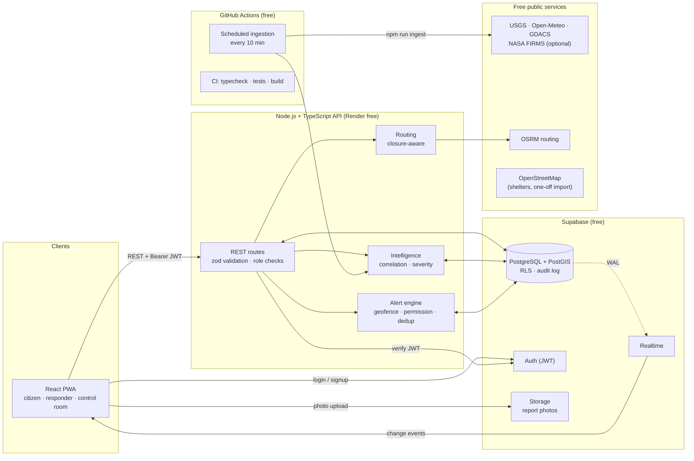
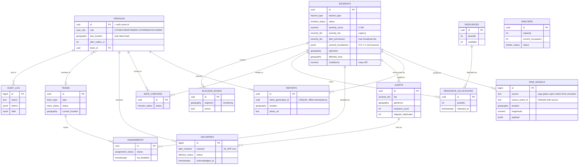
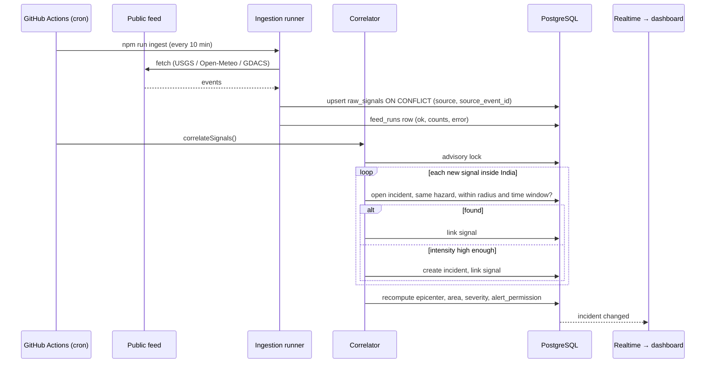
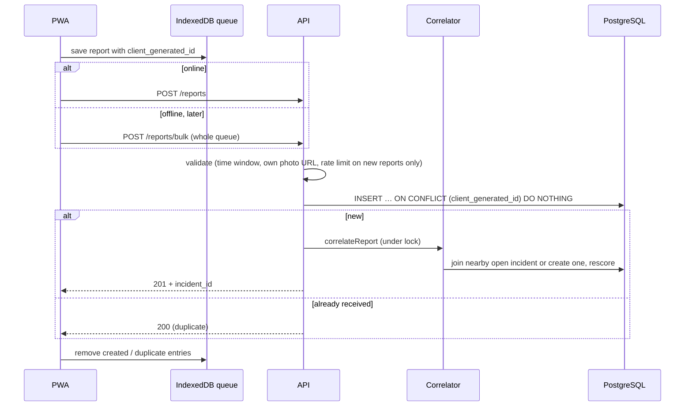
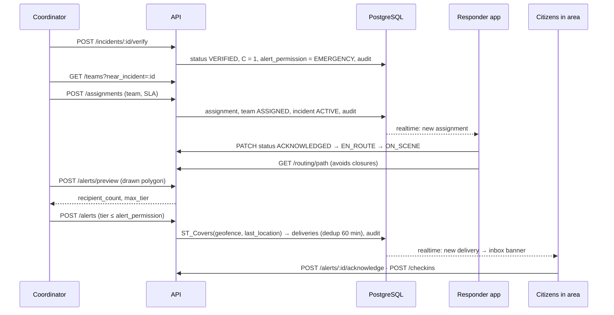
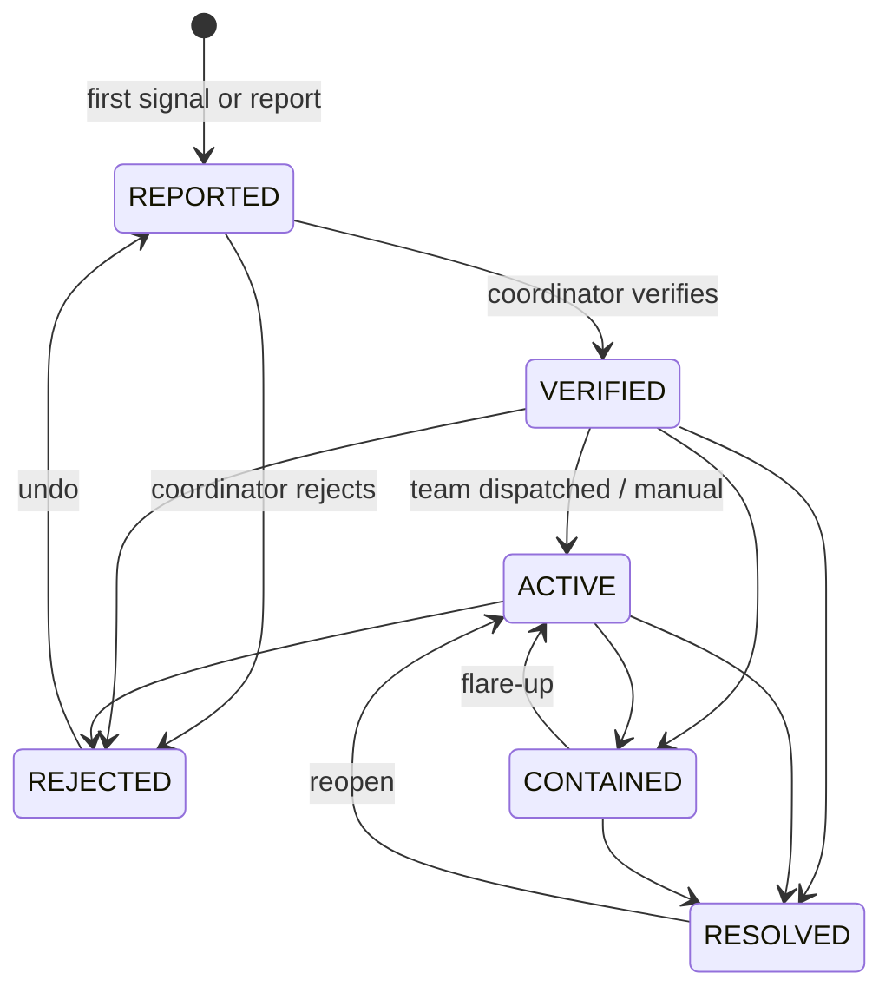
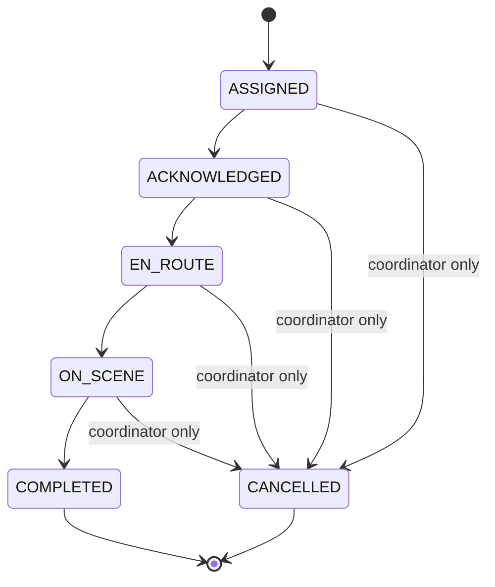

# System Design

Backend design for the Intelligent Disaster Monitoring and Emergency Communication Network.
All diagrams are Mermaid and render on GitHub. Measured results are in [METRICS.md](METRICS.md);
the endpoint reference is [API-CONTRACT.md](API-CONTRACT.md).

## 1. Architecture

**Key decisions**

| Decision | Reason |
|---|---|
| PostGIS for all location logic | Geofence, correlation, nearest-shelter and closure checks are single indexed SQL queries (M1: 1.8 ms for 100 k users). |
| Browser never writes to the database | All writes go through the API, which validates, checks roles and writes the audit log. RLS still guards every table as a second layer. |
| Ingestion runs in GitHub Actions, not on the API host | The free API host sleeps when idle; a scheduled job is reliable and costs nothing. |
| Rule-based severity, no ML | No labelled training data exists; every score must be explainable (Severity-Model.pdf §6). |
| Correlation serialised with an advisory lock | Concurrent report submissions and ingestion runs can't create duplicate incidents. |
| Urgency and alert permission stored separately | A high score never authorises a public alert by itself (report §9 C3). |

**Code layout** (`apps/api/src`)

| Folder | Contents |
|---|---|
| `ingestion/` | One adapter per feed (`FeedAdapter` interface), runner with idempotent upsert. New source = new adapter (FR-22). |
| `intelligence/` | `correlate.ts` (grouping, recompute), `severity.ts` (pure scoring functions + tests), `config.ts` (defaults). |
| `routing/` | OSRM client with closure checks and detours. |
| `simulator/` | Demo scenarios and cleanup. |
| `routes/` | One Express router per resource. |
| `lib/` | DB pool, audit writer, settings loader, geo SQL helpers. |

## 2. Data model

Also: `feed_runs` (ingestion health), `settings` (admin overrides), `sms_outbox` (reserved for the SMS channel).
Every location column has a GiST index. `audit_log` rejects `UPDATE`, `DELETE` and `TRUNCATE` via triggers, for every role.

## 3. Main flows

### 3.1 Feed signal → incident

### 3.2 Citizen report (online or offline)

### 3.3 Verify → dispatch → alert

## 4. State machines

### Incident

Only REPORTED, VERIFIED and ACTIVE incidents absorb new evidence.

### Assignment

A team holds at most one open assignment (partial unique index).

### Alert permission

| Evidence | `alert_permission` |
|---|---|
| Coordinator verified | EMERGENCY |
| Official source with hazard intensity H ≥ 0.35 (e.g. ≥ 64.5 mm rain, ≥ M5 shallow quake, GDACS Orange) | WARNING |
| Confidence ≥ 0.6 (≈ 3 independent citizen reports) | WATCH |
| Otherwise | INFO (no alerts) |
| Alert without a linked incident | WATCH at most |

## 5. Role permissions

| Capability | Public | Citizen | Responder | Coordinator | Admin |
|---|:-:|:-:|:-:|:-:|:-:|
| View incident map, signals, shelters, closures | ✓ | ✓ | ✓ | ✓ | ✓ |
| Submit reports, check-ins; read own alerts | | ✓ | ✓ | ✓ | ✓ |
| See citizen reports on an incident, resources | | | ✓ | ✓ | ✓ |
| Update own team's assignments and position; shelter occupancy | | | ✓ | ✓ | ✓ |
| Verify / reject / change incidents | | | | ✓ | ✓ |
| Dispatch teams, allocate resources, close roads | | | | ✓ | ✓ |
| Issue alerts | | | | ✓ | ✓ |
| Feed health, analytics, view settings, list users | | | | ✓ | ✓ |
| Change roles, change settings, audit log, poll feeds, simulator | | | | | ✓ |

Enforced twice: `requireRole` in the API, and row-level security for any direct database access from the browser.

## 6. Security and privacy

- Supabase Auth JWT on every non-public route; the role is read from the database on each request, never trusted from the token.
- Every request body and query is validated with zod schemas shared with the frontend.
- Users cannot change their own role or location through direct database access (column-level grants).
- Photos can be uploaded only into the user's own storage folder, and the API accepts only those URLs.
- Only the latest location is stored (NFR-8); deleting an account cascades to profile, reports and check-ins.
- Reports are rate-limited (60 new per hour); re-sent duplicates don't count.
- Every privileged action writes an append-only audit entry.
- Geofences are validated and capped at 25,000 km².

## 7. Cost

| Service | Plan | Used for |
|---|---|---|
| Supabase | Free | Database, auth, storage, realtime |
| Render | Free | API (sleeps when idle) |
| GitHub Actions | Free (unlimited for public repos) | CI, scheduled ingestion |
| USGS, Open-Meteo, GDACS, OSRM, OpenStreetMap | Free, no key | Data and routing |
| NASA FIRMS | Free key | Optional fire feed |

Total recurring cost: **₹0** (NFR-14).
